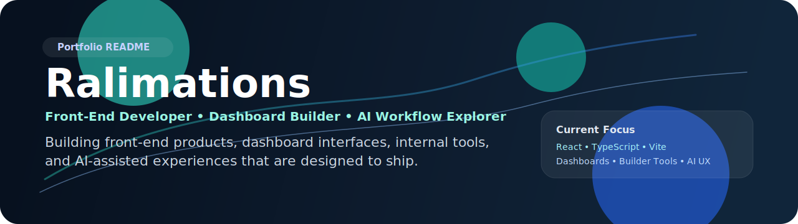

### Front-End Developer • Dashboard Builder • AI Workflow Explorer

> I build software that is meant to be used, maintained, and shipped.  
> My work spans front-end product work, dashboard interfaces, internal tools, AI-assisted experiments, and practical workflow automation.

---

## Profile

<table>
  <tr>
    <td><strong>Experience</strong></td>
    <td>5 months of front-end development work across personal projects and product-style implementations</td>
  </tr>
  <tr>
    <td><strong>Primary lane</strong></td>
    <td>Front-end engineering, dashboards, internal tools, content-driven interfaces, and maintainable UI systems</td>
  </tr>
  <tr>
    <td><strong>Professional exposure</strong></td>
    <td>Meld CX Skunkworks work involving AI Boxes, edge-device related initiatives, and operational UI workflows</td>
  </tr>
  <tr>
    <td><strong>Current direction</strong></td>
    <td>Sharpening product-level front-end skills while expanding into AI tools, automation, and broader full-stack capability</td>
  </tr>
</table>

## Toolkit

  
  
  
  
  
  
  
  

  
  
  
  
  
  
  

## GitHub Overview

  
  

## Featured Work

  
  

  
  

  
  

## Case Studies

- **FlexAI**
  Fitness-focused front-end concept combining AI-assisted food analysis, tracking flows, and planning-oriented UX. Built to explore how utility, data, and guided interactions can live inside a cleaner product interface.

- **MorphScale**
  Visual transformation tracker built around camera alignment and progress capture. The core idea is consistency in input and clearer visual feedback over time, with packaging work that leans toward mobile-oriented usage.

- **VarBridge**
  Developer-facing utility for mapping backend schema variables to frontend aliases. This project leans more toward tooling and systems clarity than visual polish, with a focus on reducing integration drift across layers.

- **PulseVision Live Rep Counter**
  AI-assisted workout tracker using camera-enabled flows for rep counting and live exercise feedback. It reflects my interest in combining interaction design with model-driven experiences that feel usable rather than gimmicky.

- **Viana Builder / Viana Builder v2**
  Builder-style dashboard interfaces exploring dense operational layouts, modular navigation, and CMS-like patterns. These are closer to internal-tool thinking: structure, hierarchy, data visibility, and workflow density.

## What I Build

| Category | Focus |
| --- | --- |
| Front-end products | React and TypeScript interfaces designed for clarity, usability, and maintainability |
| Dashboards and internal tools | Admin screens, operational views, data-heavy layouts, and workflow-oriented UI |
| AI-assisted apps | Tools that combine interface work with model-driven or camera-driven workflows |
| Builder-style systems | CMS-like or dashboard-builder interfaces for structured content and operational use cases |
| Automation | PowerShell-driven maintenance, content sync, and practical workflow improvements |

## Work Across Accounts

- Other GitHub accounts used for project work: [@Ralthology](https://github.com/Ralthology) and [@Ralisma](https://github.com/Ralisma)
- Cross-account personal work includes:
  [rhythme](https://github.com/Ralthology/rhythme),
  [local-builder](https://github.com/Ralisma/local-builder),
  [muse_writing_partner](https://github.com/Ralisma/muse_writing_partner),
  [Vite_Dashboard](https://github.com/Ralisma/Vite_Dashboard),
  [dashboard-todo](https://github.com/Ralisma/dashboard-todo),
  [OJT_TASK-1_INTRO-Login_Register_Dashboard](https://github.com/Ralthology/OJT_TASK-1_INTRO-Login_Register_Dashboard)
- Additional company and private work is represented here through skills, tooling, and work categories when direct repository sharing is not appropriate

## Now Building

- Sharpening portfolio-quality front-end projects with stronger UX polish
- Expanding from static and dashboard work into more tool-like products
- Exploring AI-assisted interfaces that still feel practical and product-minded

## Contact

- GitHub: [@Ralimations](https://github.com/Ralimations)

---

Some work lives on other GitHub accounts, and some professional work remains private. This profile is designed to give a clearer public view of the tools, product types, and implementation areas I’ve actually worked on.
